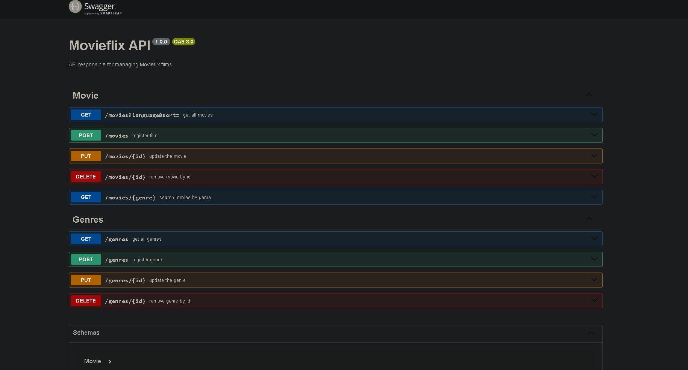

# Project MovieFlix API

The main objective in creating this API was to practice the use of an ORM to facilitate queries to the Postgres database without having to use pure SQL language, I used Prisma for this where it has a simple and robust interface that abstracts low-level codes.
Also in conjunction with the first objective was to build and configure a solid project with a simple but flexible base where its base can be used in various contexts without breaking due to incompatibility or poor configuration.
[]

## technologies used

### Node

javascript code execution environment on the server side, allowed me to create the application.

### Prisma (ORM)

Prisma is a tool for Node.js and TypeScript that facilitates interaction between code and database. It eliminated the need to write SQL queries manually, offering a modern development experience with support for static typing. Its main tools include Prisma Client, which simplifies database access, and Prisma Migrate, which automatically generates SQL files based on Prisma schema,
I used this ORM to facilitate querying the database without having to use SQL code directly, the prism
abstracts low-level details.

### Express

I used this framework to develop my web application in Node.js. It simplifies creating HTTP servers and handling routes. With Express, I defined routes to handle requests and responses, I configured middleware to process different aspects of my application.

### Typescript

I used typescript to help me develop the api, it adds advanced features to JavaScript, such as static typing and interfaces, making it easier to detect and prevent errors during the development phase. TypeScript helped me develop the application with higher quality, ensuring code consistency and security. With it, it is possible to detect syntax and logic errors before execution, avoiding bugs and compatibility problems.

### Prettier

I configured Prettier at the base of the project, it automatically reformats the existing "old" code, transforming and correcting it to follow a predefined style, ensuring visual consistency.

### EditorConfig

I used the editorconfig file at the root of the project to maintain a standard
of code between different editors, indentation among other style issues, it maintains the consistency of the code at run time but does not correct codes already created.

### Environment Variables ".ENV"

I created the .ENV file with the aim of allowing dynamic configuration of parameters in variables in different environments, such as development, testing and production. They offer a flexible way to provide environment-specific information to the application, allowing it to automatically adapt to execution conditions without the need to modify the source code. I did this to facilitate portability and consistent configuration across different contexts for my API.

### Swagger

Swagger is a tool that helped me create documentation for my API, providing a design to make it easier to understand how to use it, and it also allowed me to carry out tests to ensure the correct return of the required data.

## How to use

1 - clone for project

```
git clone <url>
```

2 -access the project folder

```
cd repositorio-com-readme
```

3 -install project packages

```
npm install
```

4 -start the project

```
npm start
```
